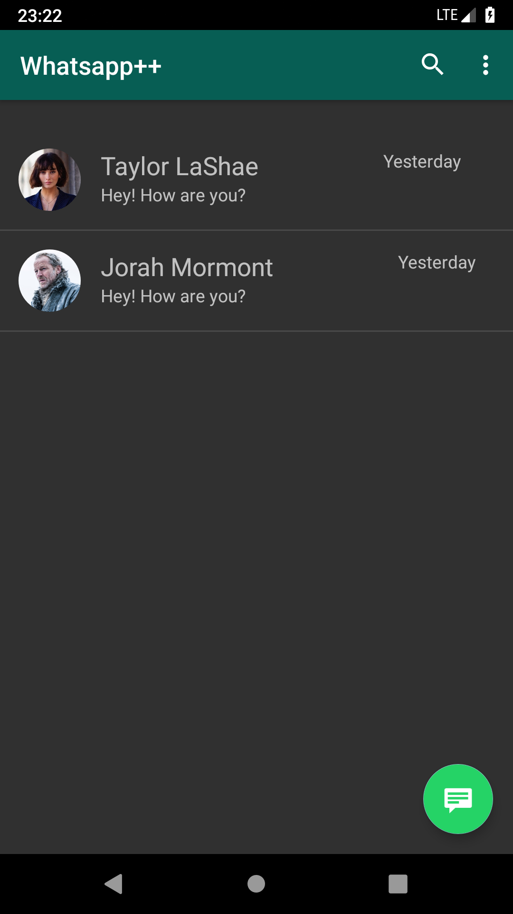
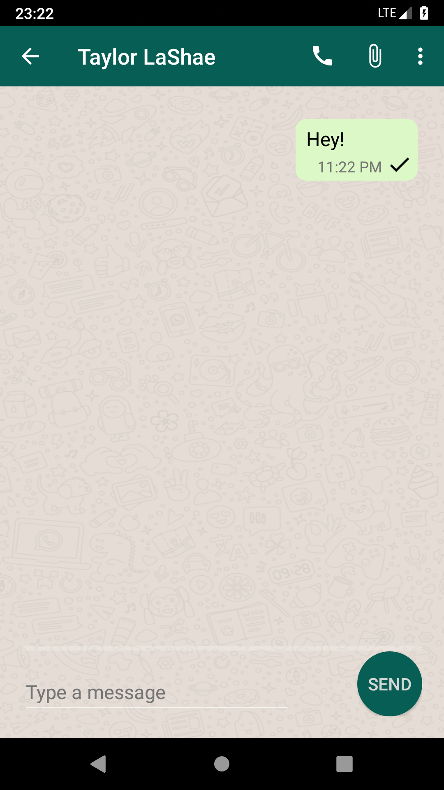

# Xamarin.Android-WhatsApp-UI

### A basic user-interface of WhatsApp using Xamarin.Android

## Screenshots

  

## Features

#### It's just a user-interface that includes these layouts
- chat list
- adding contact
- chat
- contact's detail

## Built With
- #### [Xamarin.Android](https://docs.microsoft.com/en-us/xamarin/android/) - exposes the complete Android SDK for .NET developers. Build fully native Android apps using C# or F# in Visual Studio.
